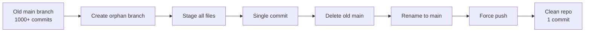

After running achievements, your target repository will contain many commits, branches, and pull requests. This guide shows you how to clean up and restore your repository to a clean state.

## What Gets Created

When you run achievements, the CLI creates:

- **Branches**: Temporary feature branches (e.g., `pair-extraordinaire-1`, `pull-shark-2`)
- **Commits**: Multiple commits on each branch
- **Pull Requests**: PRs for each operation (later merged and closed)
- **Issues**: For Quickdraw achievement
- **Discussions**: For Galaxy Brain achievement

While branches are automatically deleted after merging, the commits remain in your repository's history.

<Note>
  For most achievements, you might run 10-1024 operations, resulting in thousands of commits in your repository's history.
</Note>

## Reset Repo History Feature

The CLI includes a built-in **Reset Repo History** feature that squashes all commits into a single clean commit.

### How It Works

<Accordion title="Git Orphan Branch Strategy">
  The reset feature uses Git's orphan branch strategy:
  
  1. Creates a new orphan branch (`clean-slate`) with no history
  2. Stages all current files
  3. Creates a single "Initial commit"
  4. Deletes the old `main` branch
  5. Renames `clean-slate` to `main`
  6. Force pushes to the remote repository
  
  From `src/app/screens/ResetHistoryScreen.tsx:38-58`:
  ```typescript
  await execAsync('git checkout --orphan clean-slate');
  await execAsync('git add -A');
  await execAsync('git commit -m "Initial commit"');
  await execAsync('git branch -D main');
  await execAsync('git branch -m main');
  await execAsync('git push -f origin main');
  ```
</Accordion>

<Accordion title="What Gets Preserved">
  - ✅ All current files in the repository
  - ✅ Current code state
  - ✅ Repository settings
  - ❌ Commit history (squashed to one commit)
  - ❌ Branch references (reset to new history)
</Accordion>

<Accordion title="What Remains on GitHub">
  Even after resetting commit history:
  - ✅ Pull requests remain visible
  - ✅ Issues remain visible
  - ✅ Discussions remain visible
  - ✅ All are still listed in your GitHub contribution graph
  
  To fully clear these, you must delete and recreate the repository (see below).
</Accordion>

## Using Reset Repo History

<Steps>
  <Step title="Open the main menu">
    Run `npm start` to launch the CLI.
  </Step>

  <Step title="Select 'Reset Repo History'">
    Use arrow keys to navigate to **Reset Repo History** and press Enter.
  </Step>

  <Step title="Review the warning">
    You'll see:
    
    ```
    This will squash all commits into a single "Initial commit".
    Target: your-username/your-repo
    
    Warning: This will permanently delete all commit history!
    ```
    
    Make sure you understand the implications before proceeding.
  </Step>

  <Step title="Confirm the operation">
    Type `y` or select **Yes** to confirm.
    
    The CLI will:
    1. Create an orphan branch
    2. Stage all files
    3. Create a clean commit
    4. Replace the main branch
    5. Force push to GitHub
  </Step>

  <Step title="Wait for completion">
    You'll see progress messages:
    
    ```
    Creating orphan branch...
    Staging all files...
    Creating clean commit...
    Removing old main branch...
    Renaming to main...
    Force pushing to remote...
    
    ✓ Repository history has been reset!
    All commits squashed into a single clean commit.
    ```
  </Step>
</Steps>

<Warning>
  This operation cannot be undone! Make sure you have a backup if you need to preserve the commit history.
</Warning>

### What Happens During Reset

The reset operation follows this sequence:



## Manual Git Reset (Alternative)

If you prefer to reset manually without the CLI:

```bash
cd /path/to/your/repo

# Create orphan branch
git checkout --orphan clean-slate

# Stage all files
git add -A

# Create initial commit
git commit -m "Initial commit"

# Delete old main branch
git branch -D main

# Rename clean-slate to main
git branch -m main

# Force push to remote (WARNING: destructive!)
git push -f origin main
```

<Warning>
  Force pushing (`git push -f`) is destructive and will overwrite the remote repository. Make sure no one else is working on this repository.
</Warning>

## Cleaning Up Branches

Most branches are automatically deleted after PRs are merged, but you can verify:

### Check for Remaining Branches

```bash
cd /path/to/your/repo
git branch -a
```

You should only see:
- `main` (local)
- `remotes/origin/main` (remote)

### Delete Local Branches

If you see leftover achievement branches:

```bash
# Delete all local branches except main
git branch | grep -v "main" | xargs git branch -D
```

### Delete Remote Branches

Check for remote branches:

```bash
git ls-remote --heads origin
```

Delete them:

```bash
# Delete specific branch
git push origin --delete branch-name

# Or use GitHub's web interface:
# Repo > Branches > Delete each branch
```

## Deleting and Recreating the Repository

To completely clear PR history from your GitHub profile, you must delete and recreate the repository.

<Warning>
  This is the most destructive option. Only do this if you want to completely remove all traces of achievement operations from your GitHub profile.
</Warning>

<Steps>
  <Step title="Back up your repository (if needed)">
    If you have any files you want to keep:
    
    ```bash
    cd /path/to/your/repo
    
    # Save current state
    cp -r . ~/backup/repo-backup/
    
    # Or create a git bundle
    git bundle create repo-backup.bundle --all
    ```
  </Step>

  <Step title="Delete the repository on GitHub">
    1. Go to your repository on GitHub
    2. Click **Settings**
    3. Scroll to the bottom to the "Danger Zone"
    4. Click **Delete this repository**
    5. Type the repository name to confirm
    6. Click **I understand the consequences, delete this repository**
  </Step>

  <Step title="Create a new repository with the same name">
    1. Go to [github.com/new](https://github.com/new)
    2. Enter the exact same repository name
    3. Choose public or private (same as before)
    4. **Do NOT initialize with README** (if you want to push your backup)
    5. Click **Create repository**
  </Step>

  <Step title="Push your code to the new repository">
    ```bash
    cd /path/to/your/repo
    
    # Update remote URL (should be the same)
    git remote set-url origin https://github.com/your-username/your-repo.git
    
    # Push to new repository
    git push -u origin main
    ```
  </Step>
</Steps>

### What This Clears

- ✅ All commit history
- ✅ All pull requests (no longer visible)
- ✅ All issues (no longer visible)
- ✅ All discussions (no longer visible)
- ✅ All activity from contribution graph

### What This Preserves

- ✅ Repository name and URL
- ✅ Current code/files (if you pushed them)
- ❌ Stars, watchers, forks (these are lost)
- ❌ Settings (must reconfigure)

<Note>
  Your achievement badges remain on your profile! GitHub's achievement system tracks that you earned them, even if the repository is deleted.
</Note>

## Best Practices for Cleanup

### Immediate Cleanup

After running achievements:

1. ✅ Wait for achievements to appear on your profile (can take a few minutes)
2. ✅ Use **Reset Repo History** to squash commits
3. ✅ Keep the repository if you might run more achievements later

### Deep Cleanup

If you're done with achievements and want a completely clean slate:

1. ✅ Verify achievements appear on your profile
2. ✅ Use **Reset Repo History** first
3. ✅ Wait 24 hours (ensures GitHub's systems have registered achievements)
4. ✅ Delete and recreate the repository
5. ✅ Revoke access tokens if no longer needed

### Keep for Reference

If you want to keep a record:

1. ✅ Don't delete the repository
2. ✅ Use **Reset Repo History** to clean commit history
3. ✅ Archive the repository (Settings > Archive this repository)
4. ✅ This keeps PRs/issues visible but marks the repo as read-only

## Cleaning Up Other Resources

### Access Tokens

After you're done with achievements:

<Steps>
  <Step title="Revoke main account token">
    1. Go to [Settings > Developer settings > Personal access tokens](https://github.com/settings/tokens)
    2. Find your "GitHub Achievement CLI" token
    3. Click **Delete**
  </Step>

  <Step title="Revoke helper account token">
    1. Log in as helper account
    2. Go to [Settings > Developer settings > Personal access tokens](https://github.com/settings/tokens)
    3. Find the helper token
    4. Click **Delete**
  </Step>
</Steps>

### Local Database

Clean up local progress tracking:

```bash
# Remove all database files
rm achievements-data-*.json

# Or remove just your user's database
rm achievements-data-your-username.json
```

### Helper Account

Decide whether to keep or delete:

**Keep if**:
- You might run achievements again
- You want to help others earn achievements
- You might use it for testing GitHub features

**Delete if**:
- You're done with achievements permanently
- You don't want to maintain another account

To delete: [Settings > Account > Delete your account](https://github.com/settings/admin)

## Troubleshooting Reset Issues

### "Failed to delete old main branch"

**Problem**: The old main branch can't be deleted.  
**Solution**:
```bash
# Force delete the branch
git branch -D main

# If that fails, skip that step and continue
git branch -m main
git push -f origin main
```

### "Push rejected: protected branch"

**Problem**: Branch protection rules prevent force pushing.  
**Solution**:
1. Go to repository Settings > Branches
2. Temporarily remove branch protection rules
3. Run the reset operation
4. Re-enable branch protection after completion

### "Push failed: permission denied"

**Problem**: Your token lacks push permissions.  
**Solution**:
1. Verify your `GITHUB_TOKEN` has the `repo` scope
2. Regenerate the token if necessary
3. Update `.env` with the new token

### "Working directory is not clean"

**Problem**: Uncommitted changes in the repository.  
**Solution**:
```bash
# Stash changes
git stash

# Or commit them
git add -A
git commit -m "Save work before reset"

# Then run reset again
```